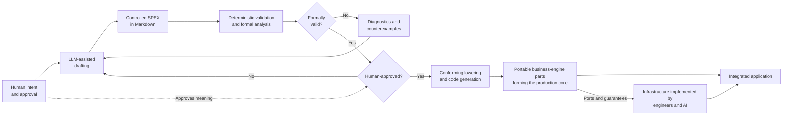

# SPEX — Executable specifications

SPEX is a proposed specification language for business behaviour and behavioural UI logic. It is intended to read like controlled natural English, live inside Markdown, and have formally defined semantics. The target model is that a human-reviewed and approved SPEX specification becomes the authoritative source of the business behaviour it defines and is compiled into portable business-engine parts that together form the production business core.

AI remains part of the process: it can help people discover and formulate requirements before approval, and it can help implement the surrounding technical infrastructure. It should not have to infer the meaning of behaviour that humans have already defined and approved.

> **Research status:** SPEX is not a finished language or production toolchain. An exploratory compiler prototype implements part of the proposed type system and compiles a limited set of specifications into TypeScript. There is no stable grammar, complete formal semantics, general solver, conformance suite, or finished execution target yet.

For a shorter introduction, see [What is SPEX supposed to become?](./description-en.md) or [Was soll SPEX werden?](./description-de.md).

## Why SPEX?

Software behaviour is often specified across conversations, documents, examples, tests, and code. Each translation between these representations can lose information, fill gaps implicitly, or introduce decisions that the people responsible for the business behaviour never reviewed.

That makes two old questions more important than ever:

> What exactly should the software do?
>
> How do we know that the software actually does exactly that?

For any particular piece of behaviour, there are three simplified cases:

| Case | Consequence |
| --- | --- |
| **We do not care about the behaviour** | A team may deliberately leave the decision open to a human or AI implementer. |
| **The specification is incomplete** | Whoever implements the missing behaviour has to guess. Software cannot be shown to match an intended behaviour that was never defined. |
| **The specification is precise** | There should be nothing left for an LLM to infer about the behaviour already defined, although technical implementation choices may remain open. |

You cannot expect even the smartest AI to implement exactly what you intended if you never expressed exactly what you intended.

Current AI-oriented spec-driven development can improve requirements elicitation, structure, and traceability. But when LLMs progressively translate a specification into plans, tasks, code, and tests, each step still interprets the previous representation. Tests and reviews may expose errors, but independently generated tests introduce another question:

> Who or what verifies that the tests themselves express what the specification says?

The deeper issue is human authority: **Which decisions are we willing to let AI infer — and which must remain explicitly defined by humans?** If we let AI decide what important software should do, we are not merely delegating programming; we are delegating the decisions themselves.

## The working thesis

> **The human-reviewed and approved SPEX specification should be the authoritative source of the business behaviour it defines.**

SPEX does not try to eliminate interpretation. It tries to place interpretation before a human-approved semantic boundary and prevent it from being repeated afterward.

The proposed model is:

1. Humans begin with ordinary, potentially incomplete language.
2. Deterministic tooling and an LLM help transform that intent into controlled SPEX statements. Anything inferred by the LLM remains a proposal.
3. A compiler and formal-analysis toolchain check what follows from the defined language semantics, such as syntax, types, references, structural completeness, contradictions, unreachable cases, and counterexamples.
4. The responsible humans decide whether a formally valid statement expresses the intended business meaning. Parts of a specification may be proposed, developer-reviewed, or domain-approved; changing approved behaviour invalidates its approval.
5. A trusted, conforming compiler lowers the accepted specification into portable business-engine parts that form the production business core.

A specification needs definitions, not impressions. Once a language has formally defined semantics, a compiler is the appropriate translation technology. Determinism alone does not resolve ambiguity or prove correctness: the language semantics must be explicit, and the compiler and runtime must be shown to preserve them.

The principle is simple:

> *Let AI interpret what is still open.*
>
> *Compile what has already been decided.*

## What is compiled, and what remains open?

There is a fundamental difference between:

> *what behaviour the system must guarantee*

and

> *how that behaviour is implemented.*

The boundary is not between software that AI may and may not write. It separates business decisions that have already been made from implementation choices that remain open.

| Specified behaviour or required guarantee | Open technical realisation |
| --- | --- |
| Typed domain concepts, values, and constraints | Machine types, encodings, and storage formats |
| Business decisions, permissions, and visibility rules | Identity providers, signed claims, and enforcement mechanisms |
| Observable state and atomic state transitions | Persistence, replication, recovery, and concurrency mechanisms |
| User intents and behavioural UI state | Widgets, layouts, rendering engines, and interaction technology |
| Outside authorities and declared boundary ports | APIs, protocols, queues, adapters, and deployment topology |
| Measurable latency, throughput, availability, and resource targets | Capacity, scaling, deployment, monitoring, and operational mechanisms |

SPEX would not directly open files, access databases, make HTTP calls, create threads, or invoke framework-specific APIs. Infrastructure would connect to the compiled business core through declared boundary ports and would have to preserve its contracts and guarantees.

For example, SPEX may define that an accepted withdrawal reduces an account balance. That state transition is business behaviour. Whether the new balance is stored in PostgreSQL, an event store, or a remote banking system is an infrastructure choice. If the balance must survive a restart, durability must be declared as a measurable requirement and satisfied by the infrastructure.

Source code can itself be the authoritative specification. It serves as a directly human-reviewable business artefact, however, only when the people responsible for the behaviour can reliably understand and review the relevant implementation. When they need a separate representation, specification and code become competing artefacts whose agreement must be maintained. SPEX instead investigates whether the readable specification can serve as the source language of the production business core itself.

## Proposed workflow

SPEX specifications are intended to remain in Markdown so they can be reviewed and versioned using ordinary documentation and source-control workflows. Approval would be recorded explicitly, and accepted statements would be retained and compiled rather than regenerated from informal requirements whenever the software changes.



The LLM may ask questions, suggest examples, and propose reformulations. It does not decide the required behaviour or define the language semantics. Formal tooling can establish validity only within the declared model; only responsible humans can establish that a valid statement says what the business intends.

The following fragment illustrates the intended reading experience; it is not a promise of stable syntax or complete prototype support:

```
An Account shall consist of:
  - a Balance of Dollars.

A Customer may Withdraw an Amount from an Account if and only if:
  - the Account belongs to the Customer; and
  - the Amount does not exceed the Account's Balance.
```

The detailed language tour—including candidate terms, rules, typed examples, state, and state transitions—is in [SPEX: Executable Specifications for AI-Assisted Development](./articles/spex-executable-specifications-for-ai-assisted-development.md).

## Validation and trust

Compiling the specification does not make validation disappear. It changes what must be validated and where trust is placed.

| Validation area | Purpose |
| --- | --- |
| **Specification examples** | Help domain experts discover misunderstandings and assess whether the formal rules express their intent. They must not silently complete missing rules. |
| **Behavioural integration validation** | Executes approved examples against the integrated application to check that persistence, communication, rendering, and other infrastructure preserve the specified behaviour. |
| **Technical validation** | Measures requirements such as performance, availability, durability, resource use, and technical security properties against the running system. |
| **Toolchain assurance** | Establishes through testing and, where required, formal verification that the compiler and runtime preserve the defined SPEX semantics. |

Provided that the toolchain can be trusted to preserve SPEX semantics, tests no longer need to duplicate business rules merely to compensate for a probabilistic translation of already-defined behaviour. Tests remain important for examples, integration, regressions, technical requirements, and the compiler toolchain itself.

## Why this might matter

SPEX targets three structural weaknesses in LLM-based specification-to-code workflows:

- **Unverified interpretation:** generated implementations may contain assumptions or decisions that nobody approved.
- **Invisible specification in tests:** missing business rules may be defined inside technical test artefacts that domain experts never review.
- **Unverified verification:** tests generated from the same specification require their own semantic translation, so agreement between code and tests does not by itself establish conformance to the specification.

If the research hypothesis holds, SPEX could reduce repeated LLM inference, duplicated business-rule conformance tests, semantic synchronisation across specifications and code, review effort for generated business logic, and dependence on frontier models. Precise compiler diagnostics may also make smaller or locally operated models more useful, reducing cost and keeping sensitive business knowledge within the organisation. These benefits remain hypotheses to be measured rather than established results.

## Research questions

The project must still determine whether:

- controlled natural English can express realistic business domains without hidden implementation assumptions;
- domain experts can efficiently understand, discuss, and approve SPEX specifications;
- compiler and formal-analysis diagnostics expose useful classes of missing, contradictory, invalid, or insufficiently precise statements;
- compiler-guided LLM assistance reduces authoring effort without introducing unapproved meaning;
- the compiler and runtime can be shown to preserve the defined semantics; and
- the boundary between business meaning and technical realisation remains practical for stateful, distributed, secure, and interactive applications.

Evaluation should measure domain-expert acceptance, unsupported assumptions, clarification and correction steps, human effort, token use, execution time, computational cost, and toolchain conformance. See the [Manifest](./manifest.md) for the complete research posture.

SPEX is not presented as an entirely new idea. It combines work from controlled natural language, formal specification, functional programming, model-driven development, Rules as Code, domain-driven design, and architectural patterns that separate business policy from technical mechanisms. See [Related Work](./comparison/related-work.md) and [Further Reading](./reference/further-reading.md) for the research map.

## Explore the knowledge base

Recommended reading order:

1. [Spec-Driven Development Gets Your Spec Wrong](./articles/spec-driven-development-gets-your-spec-wrong.md) — the semantic gap in current AI-oriented SDD.
2. [SPEX: Executable Specifications for AI-Assisted Development](./articles/spex-executable-specifications-for-ai-assisted-development.md) — the proposed language, workflow, and execution boundary.
3. [The SPEX Manifest](./manifest.md) — the current thesis, invariants, and research posture.
4. [Logical vs Physical World](./concepts/logical-vs-physical.md) and [Three Core Invariants](./concepts/three-invariants.md) — the architectural boundary and foundational principles.
5. [Related Work](./comparison/related-work.md) — prior art and adjacent systems.

| Area | Entry points |
| --- | --- |
| **Concepts** | [Overview](./concepts/overview.md), [Contract Is Code](./concepts/contract-is-code.md), [Intent-Driven UI](./concepts/intent-driven-ui.md) |
| **Grammar** | [Grammar Overview](./grammar/overview.md), [Keywords](./grammar/keywords.md) |
| **Architecture** | [Mathematical Bridge](./architecture/mathematical-bridge.md), [Interactive Design Loop](./architecture/design-loop.md), [Portable Execution Target](./architecture/execution-target.md), [Persistence Model](./architecture/persistence.md) |
| **Examples** | [Candidate specifications and evaluation scenarios](./examples/overview.md) |
| **Comparison** | [Why Spec-Driven Development Fails](./sdd/why-sdd-fails.md), [State of the Art](./comparison/state-of-the-art.md) |
| **Reference** | [Reference Overview](./reference/overview.md), [Further Reading](./reference/further-reading.md) |
