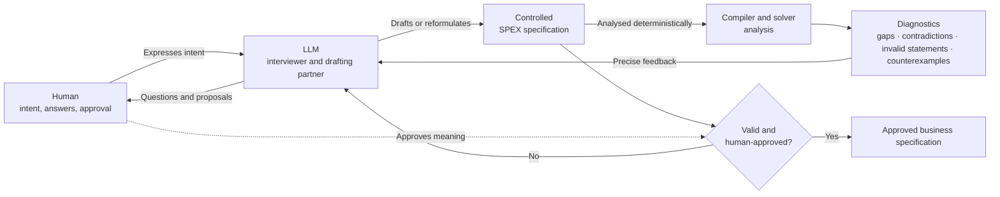

# SPEX — Executable Specifications

For a concise introduction of what SPEX is supposed to become, see
[What Is SPEX Supposed to Become?](./description-en.md) or
[Was soll SPEX werden?](./description-de.md).

## The Problem of Specifying Software Behaviour

Some software has no formal specification at all; its “specification” is scattered across emails, handwritten meeting notes, and informal conversations. Even higher-quality business specifications may appear clear in ordinary language while remaining too imprecise to determine behaviour unambiguously. When they are translated into software, information is lost, gaps are filled, and assumptions are added. The resulting code is normally inaccessible to people without a programming background, while domain experts cannot be sure that the software actually does what they intended. This is not a new problem: the software industry has struggled with it since the earliest computers.

AI-assisted development does not remove the translation problem. It performs the same translation faster, more frequently, and at a larger scale. Starting with an ambiguous specification and then relying on tests, guardrails, reviews, and probabilistic generation to recover the intended behaviour is internally contradictory. These mechanisms may detect some incorrect outcomes, but they cannot establish what the intended behaviour was when that intent was never specified precisely in the first place. More capable LLMs might guess better in the future, but do not remove the need for a precise, verifiable definition of what the system must do.

## Retaining Human Authority

Allowing an LLM to infer both the specification and its implementation would leave essential business decisions without a human-verifiable source of authority.

We must distinguish between the work AI may perform and the business meaning humans must retain, review, and control.

> **The specification, read and approved by humans, should be the authoritative business artefact.**

This repository prepares a research proposal investigating whether business logic can be expressed in a restricted, computable form of English: precise enough for formal analysis and deterministic compilation, yet readable enough to be discussed and approved by domain experts.

## The Core Idea of SPEX

Modern [spec-driven development](https://arxiv.org/pdf/2602.00180) commonly uses a non-deterministic system to transform specifications into business-critical code, then relies on tests, reviews, guardrails, and human oversight to establish trust. SPEX investigates whether the specification itself can instead become precise, authoritative, and deterministically executable. [Read the detailed analysis.](./sdd/why-sdd-fails.md)

**SPEX explores a different approach**:

> What if the approved specification were the authoritative business artefact, while generated code became a derived execution artefact rather than a separately maintained source of business logic?

This requires a specification that a deterministic compiler can translate into executable software. An LLM cannot deterministically resolve unfinished or ambiguous human intent. Given the same accepted specification, every conforming compiler must produce semantically equivalent executable business behaviour.

AI remains part of the engineering process and accelerates it, but it is not responsible for repeatedly reconstructing business logic from informal documents and existing code.
During specification, an LLM acts primarily as an interviewer and discussion partner. It helps engineers and domain experts express their knowledge, identify unclear assumptions, and formulate business rules.

The compiler would check syntax, types, references, and structural completeness. Solvers and other formal-analysis tools could identify contradictions, violated invariants, unreachable cases, and counterexamples. Together, these diagnostics identify where the specification cannot yet be accepted. 

Using these diagnostics, the LLM can:

* ask focused follow-up questions;
* help transform informal statements into valid SPEX statements;
* explain why a statement is incomplete or invalid;
* propose reformulations without silently deciding the intended meaning.

The human remains the authority over meaning. Every proposed reformulation must remain readable English and must be reviewed and accepted before becoming part of the specification. The compiler can establish syntactic and formal validity; only a human can confirm that the statement expresses the intended business meaning.

Concrete, executable examples are discussed with domain experts to reveal misunderstandings and confirm that the formal rules express their intent. The examples do not replace or complete the specification; they validate shared understanding of it. The same examples can later be reused as integration tests against the completed application.

### Figure 1: AI-Assisted Specification

Once accepted, the specification would be compiled without AI into portable business-engine parts with declared inputs, outputs, state responsibilities, and boundary ports.

The infrastructure would not need to be reviewed for its interpretation of business behaviour. Instead, it would be evaluated against declared interfaces, integration tests, and measurable non-functional requirements such as latency, availability, durability, security, and throughput.

### Figure 2: Deterministic Execution and Infrastructure

## Why This Matters

Compared with LLM-based specification-to-code workflows, a precise specification and deterministic compiler could reduce:

- repeated, token-intensive analysis of specifications and codebases;
- the need to keep separately maintained specifications, implementations, and tests semantically synchronised;
- unnecessary energy and hardware consumption;
- exposure of sensitive business knowledge to external model providers;
- review effort caused by untrusted generated business logic;
- dependence on increasingly powerful and expensive frontier models.

Smaller or locally operated models could still assist with specification and infrastructure work because the compiler provides precise, structured feedback instead of requiring the model to rediscover the entire system repeatedly.

SPEX can be understood as a rigorous form of spec-driven development: it takes the specification seriously enough to require it to be human-authoritative, formally analysable, and deterministically compilable. If those conditions can be achieved, transferring the specification into executable business behaviour should not require an LLM.

The proposed SPEX model is intended to address three structural weaknesses of LLM-based specification-to-code workflows:

- **Unverified interpretation**: The generated implementation may contain assumptions, decisions, or interpretations that nobody explicitly reviewed or approved.
- **Invisible specification in tests**: When the written specification is incomplete, teams encode missing business behaviour in tests. Those tests become an implicit, code-oriented part of the specification that domain experts may never read or approve. SPEX instead uses reviewed examples to expose misunderstandings and confirm that the formal specification expresses the intended meaning, without allowing the examples to define missing rules.
- **Unverified verification**: Because teams do not trust an LLM to translate the specification correctly, they encode the expected behaviour again in tests and guardrails. This creates a second transformation—from the specification into test code—which must itself be reviewed to ensure that it expresses the same meaning. The tests may detect some incorrect implementations, but ordinary testing cannot establish that the generated code is semantically equivalent to the complete specification. Trust is therefore shifted to another manually maintained artefact rather than established by the transformation itself.

## The Architectural Boundary

The central boundary is between **specified business meaning** and the **technical mechanisms used to realise it**.

Functional requirements define what the system means and which behaviour is allowed. Non-functional requirements shape how that behaviour is stored, distributed, rendered, integrated, secured, and operated.

| Authoritative business specification                        | Derived technical realisation                                 |
| ----------------------------------------------------------- | ------------------------------------------------------------- |
| User intents, permissions, and business decisions           | Databases, APIs, and integration adapters                     |
| Observable business state and allowed state changes         | Machine types, encodings, and persistence formats             |
| State ownership, responsibilities, and external authorities | Queues, deployment topology, and scaling                      |
| Value constraints, invariants, and transactions             | Availability, latency, durability, and security mechanisms    |
| Declared inputs, outputs, and boundary ports                | Network protocols and communication technologies              |
| Intent-driven UI state                                      | Widgets, rendering engines, and platform-specific interaction |

SPEX is also intended to support intent-driven UI specifications. The specification can define observable values, permitted user intents and valid state changes. These can be bound to different rendering technologies without placing widgets or presentation mechanics inside the deterministic business core.

## Current Status

> There is no finished SPEX language yet, no stable grammar, and no complete solver or execution target.

An exploratory compiler prototype already implements parts of the proposed type system and can compile a limited set of example specifications. It demonstrates that selected ideas are implementable, but it does not yet validate the complete research hypothesis. Its open-source release depends on the resources available to the project.

This repository contains research notes, comparisons, grammar ideas, examples, and architectural sketches from which the language and its tooling may emerge.

The current model is deliberately not a simple specification-to-code pipeline. It combines a human-controlled, compiler-driven and AI-assisted authoring loop with a deterministic execution handoff.

## Proposed Evaluation

The research should investigate whether:

- the language can express realistic business rules without relying on hidden implementation assumptions;
- compiler diagnostics expose missing cases, contradictions, invalid statements, and insufficiently precise rules;
- domain experts can understand, discuss, and approve SPEX specifications;
- LLM-assisted interviewing and reformulation reduce the effort required to produce valid specifications;
- humans can reliably verify that LLM-proposed reformulations preserve their intended meaning;
- executable examples help uncover misunderstandings during specification;
- smaller or less capable language models can achieve specification results comparable to frontier models when guided by precise compiler diagnostics.

Models would be compared by compiler acceptance, domain-expert acceptance, unsupported assumptions introduced, clarification and correction steps, human effort, token usage, execution time, and computational cost.

## Foundations and Related Work

SPEX is not presented as an entirely new idea. It builds on earlier attempts to separate business meaning from technical implementation and to make requirements formally analysable. It also builds on earlier attempts to make controlled or simplified forms of English formally interpretable and executable.

Related areas include:

* [model-driven development](./comparison/related-work.md#model-driven-architecture-mda);
* [controlled natural language](./comparison/related-work.md#controlled-english--natural-language), including [Attempto Controlled English](https://www.ace-editor.org/) and [Logical English](https://logicalcontracts.com/logical-english/);
* [formal specification languages and tools](./comparison/related-work.md#specification-languages--tools);
* [Rules as Code and computable law](./comparison/related-work.md#rules-as-code--computable-law);
* architectural boundaries such as [Clean Architecture](./comparison/related-work.md#robert-c-martin--clean-architecture) and [Hexagonal Architecture](./comparison/related-work.md#alistair-cockburn--hexagonal-architecture).

See [Related Work](./comparison/related-work.md) and [Further Reading](./reference/further-reading.md) for the broader research map.

The central challenge is whether compiler-guided LLM assistance can make precise specifications practical for humans to write without allowing probabilistic systems to become the authority over business meaning.

## Start Here

1. Read the [Manifest](./manifest.md) for the current thesis and research posture.
2. Read [Logical vs Physical World](./concepts/logical-vs-physical.md) for the functional and non-functional boundary.
3. Read [Three Core Invariants](./concepts/three-invariants.md) for the foundational principles.
4. Read [Related Work](./comparison/related-work.md) for the ideas and systems on which SPEX builds.

## Knowledge Base

### [Concepts](./concepts/)

Core ideas and principles:

* [Overview](./concepts/overview.md) — The problem SPEX addresses
* [Three Core Invariants](./concepts/three-invariants.md) — The foundational principles
* [Logical vs Physical World](./concepts/logical-vs-physical.md) — Separation of business meaning and implementation
* [Contract Is Code](./concepts/contract-is-code.md) — The specification as the single source of truth
* [Intent-Driven UI](./concepts/intent-driven-ui.md) — Declarative intent and observable state

### [Grammar](./grammar/)

Candidate controlled-English syntax and language patterns:

* [Grammar Overview](./grammar/overview.md) — Candidate language structure
* [Keywords](./grammar/keywords.md) — Formal keywords and grammatical patterns

### [Architecture](./architecture/)

Design sketches for solver-guided authoring, formal semantics, portable execution, and state responsibility:

* [Mathematical Bridge](./architecture/mathematical-bridge.md) — Connecting formal semantics and controlled English
* [Interactive Design Loop](./architecture/design-loop.md) — The LLM as a cognitive interface
* [Portable Execution Target](./architecture/execution-target.md) — Distributable business-engine parts with declared inputs and outputs
* [Persistence Model](./architecture/persistence.md) — Why writing state is an infrastructure concern

### [Examples](./examples/overview.md)

Candidate specifications, thought experiments, and possible evaluation scenarios.

### [Comparison](./comparison/)

* [Why Spec-Driven Development Fails](./sdd/why-sdd-fails.md) — The unresolved translation problem
* [State of the Art](./comparison/state-of-the-art.md) — Comparison with current approaches
* [Related Work](./comparison/related-work.md) — Prior art and adjacent research

### [Reference](./reference/overview.md)

Source documents, prior work, and external material collected during the research.
